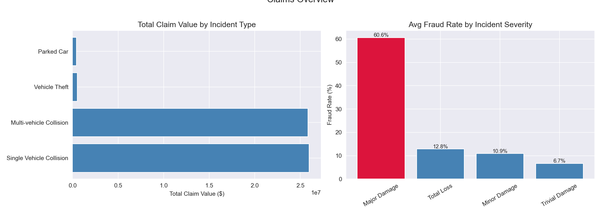
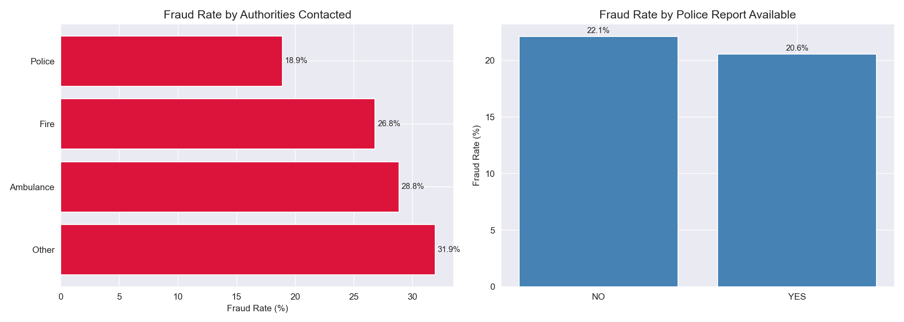
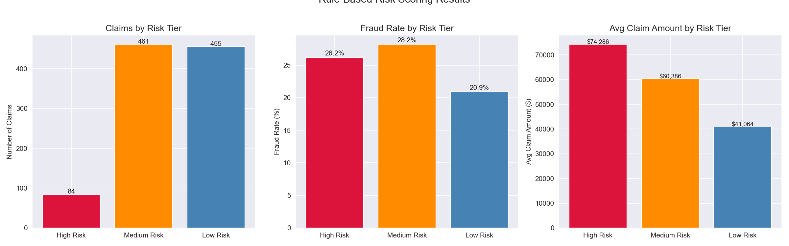
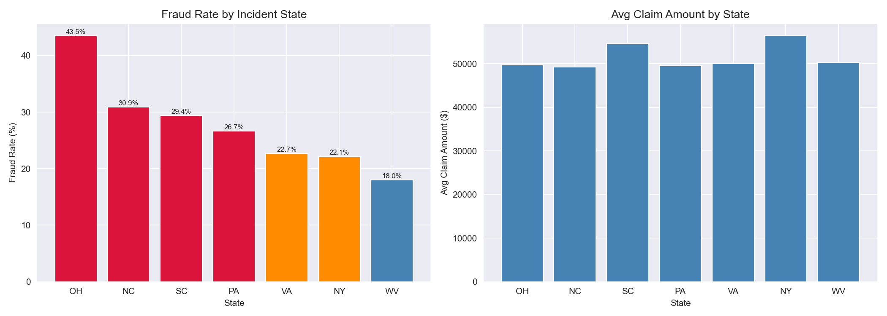
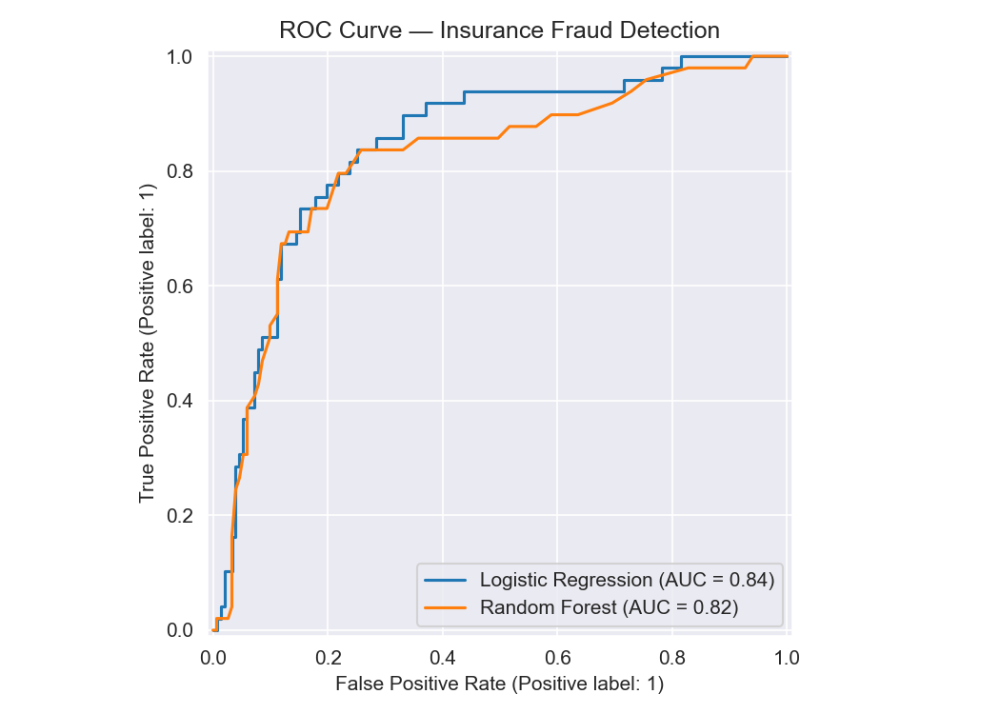
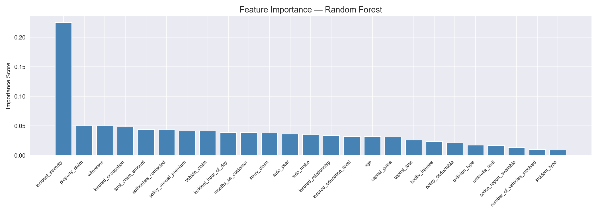
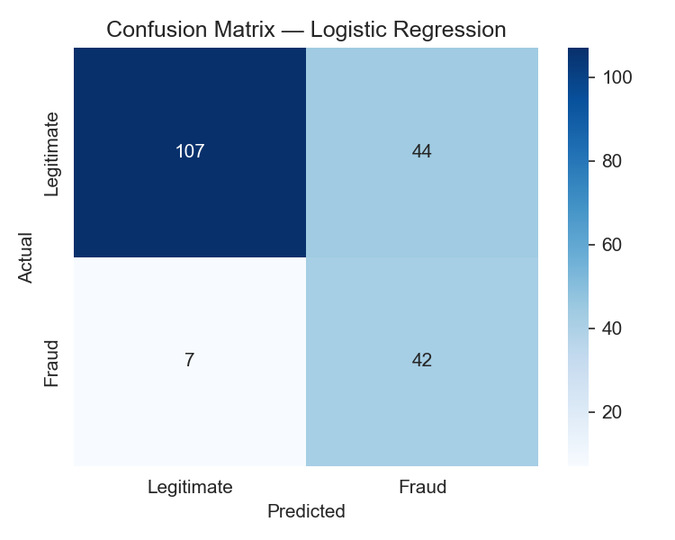
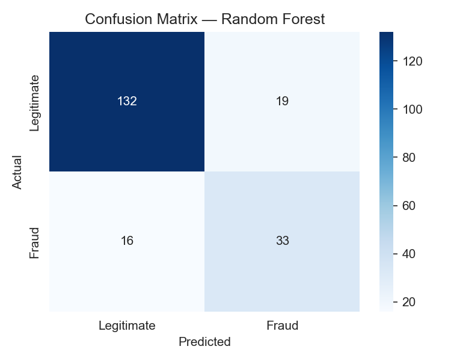

# Insurance Claims Analysis — Fraud Detection & Risk Scoring

A SQL and Python analysis of auto insurance claims data, identifying fraud patterns, building a rule-based risk scoring system, and developing machine learning models to predict fraudulent claims using PostgreSQL, Python, and Scikit-learn.

---

## Problem Statement
Insurance fraud costs the U.S. industry an estimated $40 billion annually, driving up premiums for honest policyholders and eroding insurer profitability. This project analyzes 1,000 auto insurance claims to answer:
- Which claim characteristics are most strongly associated with fraud?
- Can a rule-based risk score effectively stratify claims by fraud likelihood?
- How accurately can machine learning models predict fraudulent claims?

---

## Dataset
- **Source:** [Kaggle — Auto Insurance Claims Dataset](https://www.kaggle.com/datasets/buntyshah/auto-insurance-claims-data)
- **Size:** 1,000 claims, 39 features
- **Overall Fraud Rate:** 24.7%
- **Database:** PostgreSQL (local)

---

## Tools & Libraries
- PostgreSQL, pgAdmin
- Python 3.x
- Pandas, NumPy
- Matplotlib, Seaborn
- Scikit-learn
- Imbalanced-learn (SMOTE)
- SQLAlchemy, psycopg2

---

## Project Workflow
1. Data ingestion — loaded CSV into PostgreSQL via Python, renamed hyphenated columns to SQL-compatible snake_case, replaced missing value placeholders ('?') with NULL
2. SQL analysis — claims summary, fraud pattern analysis, rule-based risk scoring, geographic and window function analysis
3. Python visualization — pulled SQL results into Pandas DataFrames and built charts for each analysis area
4. Predictive modeling — binary fraud classification using Logistic Regression and Random Forest with SMOTE oversampling and 5-fold cross-validation

---

## SQL Techniques Demonstrated
- Common Table Expressions (CTEs)
- Window Functions (RANK, PARTITION BY, cumulative SUM OVER)
- Conditional aggregation (CASE WHEN) for fraud counting
- Rule-based risk scoring using multi-condition CASE statements
- NULLIF for safe division in fraud rate calculations
- Multi-condition HAVING and WHERE filtering

---

## Key Findings
- **Major Damage incidents** carry extreme fraud rates — Single Vehicle Collision at **62.88%** and Multi-vehicle Collision at **58.33%** — more than double the fraud rate of Total Loss incidents of the same type, suggesting damage exaggeration is more prevalent than outright claim fabrication
- Claims where **"Other" authorities were contacted** showed the highest fraud rate (**31.94%**) while Police-contacted claims showed the lowest (**18.91%**) — fraudsters actively avoid official police documentation
- **Ohio** carried the highest state fraud rate at **43.48%** — nearly double the portfolio average of 24.7% — signaling a geographic fraud concentration requiring enhanced investigation protocols
- The rule-based risk scoring system revealed an unexpected anomaly: **Medium Risk claims (28.20%)** showed a higher fraud rate than High Risk (26.19%), indicating scoring thresholds need recalibration
- **Random Forest** achieved strong cross-validation ROC-AUC of **0.95** but a test ROC-AUC of 0.82, warranting additional validation before production deployment
- **Logistic Regression** achieved the highest fraud recall (**0.86**) but low precision (0.49) — suitable for high-sensitivity screening; Random Forest's balanced precision (0.63) and recall (0.67) make it more actionable for investigation teams with limited capacity
- **Incident severity** was the dominant predictive feature at 0.225 importance — more than 4x the next most important feature, confirming it as the primary fraud risk signal in this portfolio

---

## Visualizations

### Claims Overview

### Fraud Patterns

### Risk Scoring

### Geographic Analysis

### ROC Curve Comparison

### Feature Importance

### Confusion Matrices

---

## SQL Query Files
All queries are saved in the `sql/` folder:
- `01_create_table.sql` — schema creation
- `02_claims_summary.sql` — claims overview by incident type and severity
- `03_fraud_analysis.sql` — fraud patterns by demographics and incident characteristics
- `04_risk_scoring.sql` — rule-based risk scoring system with tier classification
- `05_window_functions.sql` — claims ranking and cumulative totals by state and incident type

---

## Limitations & Next Steps
- Dataset is synthetic — fraud patterns may not reflect real-world insurance fraud distributions precisely
- Rule-based risk scoring thresholds were set manually — a production system would use data-driven threshold optimization
- Random Forest CV vs test ROC-AUC gap (0.95 vs 0.82) warrants additional validation before deployment
- Future work: threshold tuning, claim velocity features, network analysis for organized fraud ring detection, national geographic expansion

---

## How to Run This Project
1. Clone the repository
2. Install PostgreSQL and pgAdmin from [postgresql.org](https://postgresql.org)
3. Create a database called `insurance_claims` in pgAdmin
4. Download `insurance_claims.csv` from [Kaggle](https://www.kaggle.com/datasets/buntyshah/auto-insurance-claims-data) and place it in the project root folder
5. Install Python dependencies: `pip install pandas numpy matplotlib seaborn scikit-learn imbalanced-learn sqlalchemy psycopg2-binary`
6. Open `insurance_claims.ipynb` in Jupyter or VS Code
7. Update the database connection string with your PostgreSQL password
8. Run all cells — data loads automatically into PostgreSQL and all analysis runs end to end

---

## Repository Structure

---

## Author
**Mihrimah Qozat**
[LinkedIn](https://linkedin.com/in/mihrimah-qozat) |
[GitHub](https://github.com/mihrimahqozat)
